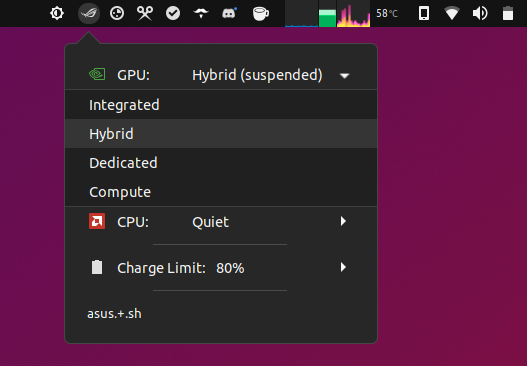

# asusctl-argos

Argos script which gives you a tray icon in Gnome to run asusctl commands (allowing control of various functions of Asus laptops)

## Requirements

- [Argos](https://github.com/p-e-w/argos)
- [asusctl](https://gitlab.com/asus-linux/asusctl). Tested on v4.0.7
- [supergfxctl](https://gitlab.com/asus-linux/supergfxctl) (optional, for gpu control). Tested on v4.0.0

## Installation

1. Install the requirements listed above (Make sure you enable Argos in Gnome Extensions)

2. Put `asus.+.sh` into your Argos scripts folder (usually `~/.config/argos/`)

3. If you want the Asus ROG tray icon to show up, you can [download it](https://gitlab.com/asus-linux/asusctl-gex/-/raw/main/icons/scalable/profile-performance.svg?inline=false) and copy it to `~/.local/share/icons/hicolor/scalable/apps/profile-performance.svg`. You might need to restart Gnome with Alt+F2, type `r` and press enter.

4. Customize the script based on what you want to see.

## Current Functionality
Note: to see the icons, your icon theme needs to have those logos.  I use Papirus Icon theme in Ubuntu.

## Possible Issues
Right now I have not found any issues on my PC but please be aware this script relies on some hardcoded aspects which may require adjustment on some hardware or with some older or future versions of asusctl and supergfxctl.

Terminal substrings and the `tr` command are used to extract the battery percentage so if this changes then these need to be adjusted.

On some laptops, the available profiles for GPU and CPU setting may be different to what is hardcoded, these can be discovered on your PC using the `asusctl profile -l` and `supergfxctl -s` commands.
